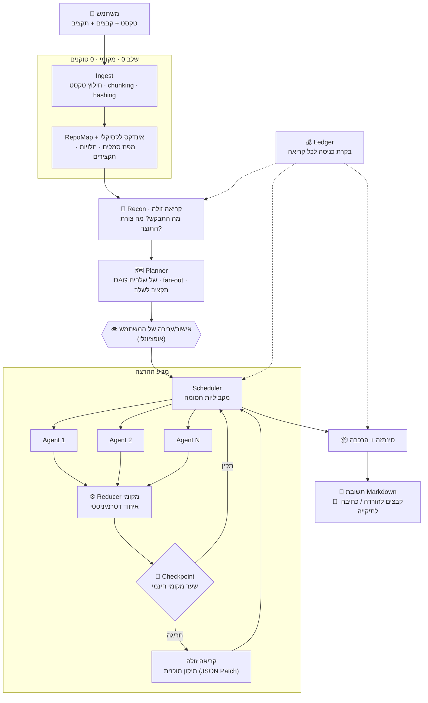

# AgentsOrchestrator

**מתזמר סוכנים אדפטיבי מעל Gemini 3.7 Flash — עם תקציב טוקנים כמשאב מנוהל.**

ממשק צ'אט שבו אתה מתאר משימה, מצרף קבצים או מחבר תיקייה שלמה, וקובע **מטרה** — כמה טוקנים מותר לשרוף.
המערכת מבינה את המשימה, בונה **תוכנית ריצה** (כמה שלבים, אילו סוכנים, כמה במקביל בכל שלב), מריצה אותה,
בודקת את עצמה בין שלב לשלב ומתקנת את התוכנית תוך כדי — ומחזירה תשובה ב־Markdown יחד עם קבצים מוכנים להורדה.

---

> ## 📍 נקודת הכניסה לעבודה: **[`docs/TASKS.md`](docs/TASKS.md)**
>
> הפרויקט נמצא כרגע ב**שלב תכנון** — יש מסמכי אפיון מלאים, עדיין אין קוד.
> כל העבודה מתחילה ומתנהלת מקובץ המשימות. אל תתחיל לכתוב קוד בלי לקרוא אותו.

---

## תוכן עניינים

- [הרעיון](#הרעיון)
- [עקרונות היסוד](#עקרונות-היסוד)
- [איך זה עובד](#איך-זה-עובד)
- [שני האתגרים המרכזיים](#שני-האתגרים-המרכזיים)
- [מפת המסמכים](#מפת-המסמכים)
- [מבנה הקוד המתוכנן](#מבנה-הקוד-המתוכנן)
- [סטאק טכנולוגי](#סטאק-טכנולוגי)
- [המודל והתמחור](#המודל-והתמחור)
- [סטטוס](#סטטוס)

---

## הרעיון

רוב כלי ה־AI מריצים סוכן אחד עם חלון הקשר גדול, שורפים טוקנים בלי שליטה, ומחזירים תשובה חתוכה כשהמשימה גדולה.

`AgentsOrchestrator` הופך את זה: **התזמור הוא אזרח מדרגה ראשונה, והטוקנים הם משאב מתוקצב.**

1. אתה נותן משימה + קבצים/תיקייה + **תקרת טוקנים** (מטרה).
2. קריאה זולה אחת מבינה מה בעצם התבקש ומה צורת התוצר.
3. **מתכנן** בונה תוכנית: שלבים, סוגי סוכנים, פיצול העבודה, וכמה סוכנים רצים **במקביל** בכל שלב — הכל בתוך התקציב.
4. הרצה שלב־אחרי־שלב. בין שלבים יש **צ'קפוינט** — ברירת המחדל היא בדיקה מקומית חינמית, ורק אם משהו חורג יוצאת קריאה זולה שמחליטה: להמשיך / לתקן את התוכנית / לעצור.
5. איחוד התוצרים נעשה **בקוד מקומי**, לא בסוכן — ולכן הוא דטרמיניסטי, חינמי, וניתן לבדיקה.

## עקרונות היסוד

| # | עיקרון | מה זה אומר בפועל |
|---|---|---|
| 1 | **קוד לפני הקשר** | אם אפשר לענות עם סקריפט מקומי (grep/AST/pandas) — לא שולחים את המידע למודל. סוכן שכותב סקריפט זול פי מאה מסוכן שקורא 200 קבצים. |
| 2 | **התקציב הוא חוזה** | כל קריאה עוברת בקרת כניסה מול פנקס טוקנים. אין חריגה שקטה — יש *הידרדרות מבוקרת* (פחות הקשר, פחות סוכנים, מודל זול יותר). |
| 3 | **מיזוג בקוד, לא בסוכן** | פלטים מאוחדים ע"י Reducers דטרמיניסטיים. LLM נכנס רק לתפירת תפרים, ורק אם בדיקה מקומית נכשלה. |
| 4 | **חוזי פלט קשיחים** | כל סוכן מחזיר NDJSON סכמתי עם תקרת טוקנים משלו. פלט קטוע ניתן לשחזור — לא זורקים עבודה. |
| 5 | **קופסה שקופה** | כל קריאה, כל טוקן, כל בייט שיצא מהמחשב — גלוי, מתועד וניתן לייצוא. |
| 6 | **תמיד יש תשובה** | חלק מהתקציב שמור מראש לסינתזה סופית. גם ריצה שנכשלה באמצע מחזירה תוצר חלקי + מה חסר ולמה. |
| 7 | **הרחבה בלי לגעת בליבה** | סוגי סוכנים, מתכונים ו־reducers הם קבצי הגדרה — לא קוד. |

## איך זה עובד



**כפתור "מטרה"** יושב ליד כפתור השליחה וקובע את כללי המשחק **לכל שליחת פקודה** (תור אחד):

| רמה | תקציב | למה זה מתאים |
|---|---|---|
| ✏️ טיוטה | 500K טוקנים | שאלה ממוקדת, קובץ בודד, סקירה מהירה |
| ⚖️ סטנדרט | 2.5M טוקנים | ברירת מחדל — מסמך, ניתוח, פיצ'ר בפרויקט |
| 🔬 עומק | 5M טוקנים | פרויקט שלם, מחקר רחב, ריפקטור חוצה־קבצים |
| ⚙️ מותאם | כל ערך | שליטה ידנית |

בנוסף נקבעים שם: רמת מאמץ (thinking level), מדיניות חריגה (הידרדרות / לשאול / לעצור), ומקסימום סוכנים במקביל.
פירוט מלא: [`docs/BUDGET.md`](docs/BUDGET.md).

## שני האתגרים המרכזיים

### 🔻 קלט ענק — "העלו לי פרויקט של 100MB"
לעולם לא שולחים בייטים גולמיים כברירת מחדל. יש **סולם קריאה** שהמתכנן בוחר בו שלב, מהזול ליקר:

`אינוונטר מקומי` → `מפת סמלים` → `חיפוש לקסיקלי` → `סקריפט פייתון מקומי` → `תקצור במודל זול (עם cache לפי hash)` → `קריאה מלאה`

תקצירים נשמרים במטמון לפי hash של תוכן — ריצה שנייה על אותו פרויקט כמעט חינם.

### 🔺 פלט ענק — תקרת 64K טוקנים לסוכן
מפרקים את התוצר לפני שכותבים אותו:

`Outliner` בונה שלד סעיפים/קבצים → כל סוכן מקבל בעלות בלעדית על סעיף או קובץ (יעד 4–12K טוקנים) →
`Assembler` מקומי מרכיב לפי סדר השלד → **הטולצ'יין של הפרויקט עצמו** (tsc / lint / test) משמש כאורקל האימות.
פלט שנקטע באמצע מתאושש דרך פרוטוקול המשכיות, לא נזרק.

הפירוט המלא של שני הסולמות: [`docs/ARCHITECTURE.md`](docs/ARCHITECTURE.md).

## מפת המסמכים

| מסמך | מה יש בו | מתי לפתוח |
|---|---|---|
| 🎯 **[`docs/TASKS.md`](docs/TASKS.md)** | **תוכנית הביצוע — 13 שלבים, משימות ממוספרות, הגדרת "גמור" לכל אחת** | **תמיד. זו נקודת הכניסה.** |
| 🏛️ [`docs/ARCHITECTURE.md`](docs/ARCHITECTURE.md) | רכיבים, זרימת נתונים, מבנה מאגר, סולמות קלט/פלט | לפני שכותבים רכיב חדש |
| 📜 [`docs/PROTOCOLS.md`](docs/PROTOCOLS.md) | סכמות: Plan, חוזי סוכן, NDJSON, מעטפת קבצים, אירועים | כשמחברים שני רכיבים |
| 💰 [`docs/BUDGET.md`](docs/BUDGET.md) | מנוע התקציב, הערכה, בקרת כניסה, סולם הידרדרות | כשנוגעים בטוקנים או בעלות |
| 🎨 [`docs/UX.md`](docs/UX.md) | אפיון ממשק: צ'אט, כפתור מטרה, לוח תזמור, ארטיפקטים, RTL | כשבונים UI |
| 🤔 [`docs/DECISIONS.md`](docs/DECISIONS.md) | החלטות ארכיטקטורה (ADR), הנחות, ושאלות פתוחות למשתמש | כשמשהו לא ברור או כשמשנים כיוון |

## מבנה הקוד המתוכנן

```
apps/
  web/                  React + Vite — ממשק המשתמש
  runtime/              שרת Node מקומי — API, WebSocket, התמדה
packages/
  core/                 מנוע התזמור (TS טהור, בלי I/O — נבדק ביחידה)
    plan/               סכמת תוכנית, ולידציה, JSON Patch
    scheduler/          DAG, מקביליות חסומה, מדיניות כשל
    ledger/             פנקס טוקנים, בקרת כניסה, הידרדרות
    reducers/           מיזוג דטרמיניסטי מקומי
  providers/            LLMProvider — מימוש Gemini (+ הפשטה לספקים אחרים)
  ingest/               חילוץ, chunking, RepoMap, אינדקס, ContextBroker
  tools/                הרצה מקומית מבודדת של Python/Node
  shared/               טיפוסים וסכמות משותפים ל־web ול־runtime
agents/                 הגדרות סוכנים — agent.md + agent.json (ללא קוד)
recipes/                תבניות תזמור שמורות
evals/                  משימות זהב + מדידת איכות/עלות
docs/                   ← המסמכים למעלה
```

## סטאק טכנולוגי

**Runtime מקומי + UI בדפדפן** (ולא דפדפן בלבד) — כדי לאפשר גישה אמיתית לקבצים, הרצת Python מקומית,
מקביליות אמיתית, ושמירת מפתח ה־API מחוץ לדפדפן. הנימוק המלא: [ADR-001](docs/DECISIONS.md#adr-001).

- **שפה:** TypeScript (strict), pnpm workspaces
- **UI:** React + Vite + Tailwind + shadcn/ui · Markdown דרך `react-markdown` + `remark-gfm` + Shiki · תמיכת RTL מלאה
- **Runtime:** Node 22 + Fastify + WebSocket · **`node:sqlite` המובנה** · לוג ריצה event-sourced
- **מפתח API:** keychain של מערכת ההפעלה דרך **`@napi-rs/keyring`** (Credential Manager ב-Windows),
  ובנפילה — קובץ מוצפן AES-GCM. אף פעם לא ב-`localStorage` ולא בלוגים.
- **בדיקות:** Vitest (יחידה/אינטגרציה) + Playwright (E2E)
- **🪟 פלטפורמות:** Windows · macOS · Linux — **שלושתן נבדקות ב-CI בכל PR, מהקומיט הראשון**.
  **אפס תלויות נייטיב שדורשות קומפילציה**, כדי שהתקנה ב-Windows לא תדרוש Visual Studio Build Tools
  ([ADR-011](docs/DECISIONS.md#adr-011), [ADR-012](docs/DECISIONS.md#adr-012)).

## המודל והתמחור

ברירת המחדל היא **`gemini-3.7-flash`** — 1M טוקני קלט, **64K טוקני פלט** (המגבלה שמכתיבה את כל אסטרטגיית הפלט),
ורמות חשיבה מכווננות (low / medium / high).

| שכבה | תפקיד | הערה |
|---|---|---|
| `tier.worker` | `gemini-3.7-flash` | סוכני העבודה — רוב הצריכה |
| `tier.cheap` | דגם Flash-Lite עדכני | צ'קפוינטים, ניתוב, סיווג — קריאות קצרות ותכופות |
| `tier.synth` | ניתן להגדרה (Flash / Pro) | סינתזה סופית בלבד |

> ⚠️ **מחירים ומזהי מודלים משתנים.** הם מרוכזים בטבלה אחת (`packages/providers/models.ts`) ומאומתים מול
> `models.list` בעלייה. משימה `P1-T7` ב־[`docs/TASKS.md`](docs/TASKS.md) אחראית לאימות ולעדכון.
> נכון לספטמבר 2026 מחיר ההשקה הוא ‎$0.75‎ למיליון קלט ו-‎$3.75‎ למיליון פלט, עם הכפלה מתוכננת ב-1 בינואר 2027 —
> ולכן ה־UI מציג **טוקנים** כמדד הראשי ו־**$** כהערכה נגזרת.

## סטטוס

| שלב | נושא | מצב |
|---|---|---|
| — | אפיון ותכנון | ✅ הושלם |
| P0–P12 | מימוש | ⬜ טרם התחיל — ראה [`docs/TASKS.md`](docs/TASKS.md) |

**להתחיל לעבוד:** פתח את [`docs/TASKS.md`](docs/TASKS.md), קח את המשימה הראשונה שלא מסומנת, ועקוב אחרי
כללי העבודה שבראש הקובץ.
