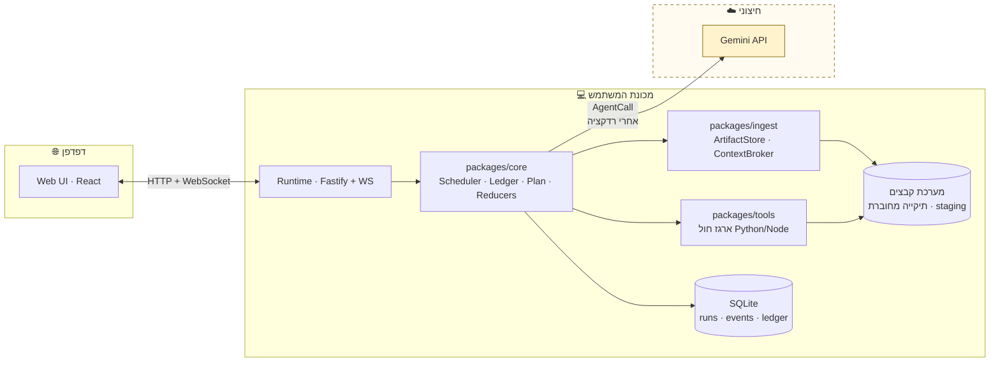
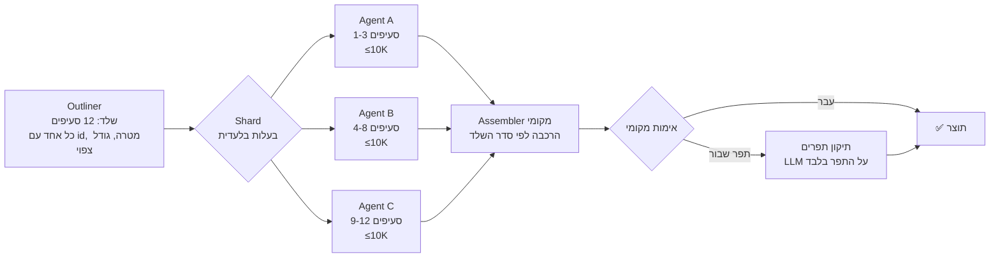

# ארכיטקטורה

> חלק ממערך המסמכים של [AgentsOrchestrator](../README.md). נקודת הכניסה לעבודה: **[`TASKS.md`](TASKS.md)**.
> חוזים וסכמות מדויקים: [`PROTOCOLS.md`](PROTOCOLS.md) · כלכלת הטוקנים: [`BUDGET.md`](BUDGET.md)

---

## 1. מילון מונחים

לפני הכל — המונחים האלה חוזרים בכל הקוד ובכל המסמכים. אלה שמות המחלקות בפועל.

| מונח | הגדרה |
|---|---|
| **Run** | הרצה שלמה של תור משתמש אחד: מקלט ועד תוצר. יחידת ההתמדה, החידוש והתקצוב. |
| **Plan** | DAG של `Stage`־ים. מסמך JSON מאומת־סכמה. ניתן לתיקון תוך כדי ריצה דרך JSON Patch. |
| **Stage** | צעד בתוכנית: מטרה אחת, סוג סוכן אחד, מדיניות fan-out אחת, תקציב אחד. |
| **Task** | יחידת עבודה של סוכן יחיד — פלח (shard) של Stage. `Stage.fanout.count` = מספר ה־Tasks. |
| **AgentCall** | קריאת LLM בודדת שמשרתת Task. יחידת החיוב והמדידה. |
| **AgentType** | תפקיד מוגדר בקובץ (`agents/<type>/`): פרומפט, חוזה פלט, שכבת מודל, תקרות. |
| **Blackboard** | מצב מובנה משותף בין שלבים: `findings`, `artifacts`, `decisions`, `openQuestions`. |
| **ArtifactStore** | כל קלט (קובץ/תיקייה) + נגזרותיו: טקסט מחולץ, chunks, hashes, תקצירים. |
| **ContextBroker** | בוחר לכל Task את ההקשר המינימלי הנדרש, מתחת לתקרת טוקנים קשיחה. |
| **Ledger** | פנקס טוקנים ועלות. בקרת כניסה לכל קריאה. מקור אמת יחיד לתקציב. |
| **Reducer** | פונקציית מיזוג **מקומית ודטרמיניסטית** של פלטי סוכנים. ללא LLM. |
| **Checkpoint** | שער בין שלבים: המשך / תקן תוכנית / עצור. |
| **Recipe** | תבנית תוכנית שמורה, שהמתכנן יכול לבחור במקום לתכנן מאפס. |
| **LocalTool** | סקריפט (Python/Node) שנוצר או נבחר, ורץ מקומית בבידוד. |

## 2. תמונת־על



**הגבול היחיד שחוצה את המכונה הוא החץ ל־Gemini.** כל בייט שעובר בו נרשם ב-`EgressLedger` וניתן לצפייה
בפאנל "מה יצא מהמחשב" ([`UX.md`](UX.md#7-פאנל-מה-יצא-מהמחשב)).

## 3. מחזור חיים של Run

```
┌─ 0 · Intake ────────────────── מקומי · 0 טוקנים ─┐
│  זיהוי סוג · חילוץ טקסט · chunking · hashing     │
│  RepoMap · אינדקס BM25 · אינוונטר                │
└──────────────────────────────────────────────────┘
                    ↓
┌─ 1 · Recon ─────────────── AgentCall אחת · זולה ─┐
│  קלט: בקשת המשתמש + אינוונטר (לא תוכן!)          │
│  פלט: TaskUnderstanding — כוונה, צורת תוצר,      │
│        קריטריוני קבלה, סוג ראיות נדרש            │
└──────────────────────────────────────────────────┘
                    ↓
┌─ 2 · Plan ──────────────── AgentCall אחת · זולה ─┐
│  קלט: Understanding + אינוונטר + תקציב + Recipes │
│  פלט: Plan (DAG) — כולל תקציב והערכה לכל שלב     │
│  ולידציה מקומית: סכמה · DAG · סכום תקציבים       │
│  אופציונלי: אישור/עריכה של המשתמש                │
└──────────────────────────────────────────────────┘
                    ↓
┌─ 3 · Execute ─────────────────── לכל Stage ──────┐
│  a. Checkpoint — שער מקומי, ורק בחריגה LLM זול   │
│  b. Broker בונה הקשר לכל Task מתחת לתקרה         │
│  c. Ledger מאשר או מוריד דרגה                    │
│  d. fan-out מקבילי חסום                          │
│  e. Reducer מקומי ממזג                           │
│  f. עדכון Blackboard + Ledger                    │
└──────────────────────────────────────────────────┘
                    ↓
┌─ 4 · Assemble ──────── מקומי + סינתזה אחת לכל היותר ─┐
│  הרכבה לפי שלד · אימות · תיקון תפרים בלבד            │
└──────────────────────────────────────────────────────┘
                    ↓
┌─ 5 · Deliver ────────────────────────────────────┐
│  Markdown לצ'אט + ארטיפקטים ל-staging            │
│  כתיבה לתיקייה — רק באישור מפורש, עם diff        │
└──────────────────────────────────────────────────┘
```

**הצעד הקריטי הוא 0.** ככל שיותר עבודה נעשית שם, כך פחות טוקנים נדרשים בכל השאר.

## 4. סוגי סוכנים

הרישום מוגדר בקבצים תחת `agents/<type>/` — `agent.md` (פרומפט) + `agent.json` (חוזה, שכבת מודל, תקרות).
**הוספת סוג סוכן חדש לא דורשת שינוי קוד.**

| סוג | תפקיד | שכבה | תקרת פלט טיפוסית |
|---|---|---|---|
| `recon` | הבנת הבקשה וצורת התוצר | cheap | 2K |
| `planner` | בניית ה-DAG | worker | 8K |
| `checkpoint` | החלטת המשך/תיקון (מחזיר JSON Patch) | cheap | 1K |
| `outliner` | שלד התוצר לפני כתיבה — **המפתח למגבלת 64K** | worker | 4K |
| `toolsmith` | כותב סקריפט מקומי במקום לקרוא נתונים | worker | 4K |
| `reader` | קורא פלח חומר ומחזיר ממצאים מובנים | worker | 8K |
| `analyst` | הסקה מעל ממצאים (לא מעל חומר גולמי) | worker | 12K |
| `coder` | כותב/עורך קבצים — בעלות בלעדית על קובץ | worker | 16K |
| `writer` | כותב סעיף אחד של מסמך | worker | 12K |
| `critic` | בודק תוצר מול קריטריוני קבלה | cheap | 4K |
| `synthesizer` | הרכבה נרטיבית סופית | synth | 16K |

### מצבי fan-out

התשובה הישירה ל"כמה סוכנים רצים במקביל על אותה משימה":

| מצב | מה קורה | מתי |
|---|---|---|
| `shard` | חלוקה לפלחים זרים — כל סוכן חלק אחר (map) | קלט/פלט גדול. **המצב הנפוץ.** |
| `ensemble` | אותה משימה ל-N סוכנים בזוויות שונות → הצבעה/מיזוג | החלטה קריטית, סיכון להזיה |
| `debate` | N מייצרים, `critic` בוחר וממזג | שאלות עיצוב פתוחות |
| `pipeline` | ליטוש טורי (טיוטה → ביקורת → תיקון) | איכות חשובה יותר מזמן |
| `single` | סוכן אחד | ברירת מחדל לשלבים קלים |

`ensemble` ו-`debate` מכפילים עלות ולכן מותרים רק כשהתקציב מרשה — ה-`Ledger` חוסם אותם אוטומטית ב-`draft`.

## 5. ArtifactStore ו-ContextBroker

### 5.1 קליטה (מקומית, ללא טוקנים)

| סוג | מיצוי | נגזרת |
|---|---|---|
| קוד | tree-sitter → מפת סמלים | חתימות, ייצוא/ייבוא, גרף תלויות |
| PDF | `pdfjs-dist` | טקסט לפי עמוד + כותרות |
| DOCX / PPTX | `mammoth` / `jszip`+XML | טקסט + מבנה |
| XLSX / CSV | `sheetjs` | סכמה, טווחים, סטטיסטיקות — **לא כל השורות** |
| תמונה | מטא-דאטה בלבד | נשלחת למודל רק אם המתכנן ביקש במפורש |
| ארכיון | פריסה + סינון | הפעלת אותו סולם רקורסיבית |
| בינארי לא מוכר | hash + גודל + זיהוי סוג | נרשם בלבד |

כל artifact מקבל `sha256`. **כל נגזרת ממוטמנת לפי ה-hash הזה** — ריצה חוזרת על אותו חומר לא משלמת שוב.

### 5.2 סולם הקריאה — מהזול ליקר

זו התשובה ל"מה עושים כשהמשתמש העלה 100MB". המתכנן בוחר דרגה לכל שלב, וה-`ContextBroker` אוכף.

| דרגה | מה זה | עלות טוקנים |
|---|---|---|
| **R0 · אינוונטר** | עץ, גדלים, שפות, LOC, git | **0** |
| **R1 · מבנה** | מפת סמלים, נקודות כניסה, קונפיג, מפת בדיקות | **0** |
| **R2 · אחזור** | BM25 מקומי → K קטעים רלוונטיים | **0** (רק הקטעים הנבחרים נשלחים) |
| **R3 · סקריפט** | `toolsmith` כותב Python שרץ מקומית ומחזיר תוצאה קטנה | ~2–4K לסקריפט |
| **R4 · תקצור** | מודל זול מתקצר קבצים שעברו סינון רלוונטיות, בתקרה קשיחה | בינוני · ממוטמן לפי hash |
| **R5 · קריאה מלאה** | החומר עצמו נכנס להקשר | יקר · דורש הצדקה מפורשת |

**מדיניות ברירת מחדל:** R0+R1 תמיד. R2 לפי שאילתה. R3 כשהשאלה כמותית או מבנית. R4 לקבוצה מסוננת בלבד.
R5 רק לרשימה מפורשת וקטנה. `draft` חוסם R5 לגמרי.

### 5.3 תקציב הקשר לכל Task

לכל Task יש `contextBudget` קשיח. ה-Broker ממלא אותו בסדר עדיפויות יורד, ועוצר כשהתקציב נגמר:

```
1. Contract Block   — משותף וקבוע לכל השלב (ממוטמן בענן — ראה §7)
2. הפלח של ה-Task   — מה שהסוכן הזה אחראי עליו
3. ראיות מ-R2/R3    — קטעים מאוחזרים
4. ממצאים קודמים    — מה-Blackboard, מסונן לרלוונטיות
5. ראיות רקע        — רק אם נשאר מקום
```

סוכן שחסר לו מידע לא ממציא — הוא מחזיר `{"t":"need", ...}` וה-Broker מחליט אם לשלם על סבב נוסף.

## 6. פלט גדול — התמודדות עם תקרת 64K

הבעיה: תוצר גדול מהתקרה של סוכן יחיד. הפתרון: **לא לתת לאף סוכן לכתוב יותר ממה שהוא יכול.**



**חמשת המנגנונים:**

1. **שלד לפני תוכן** — `outliner` מייצר מבנה בפלט קטן. המבנה הוא חוזה החלוקה.
2. **בעלות בלעדית** — לכל סעיף/קובץ בדיוק סוכן אחד. אין התנגשויות כתיבה, אין כפילויות.
3. **הרכבה בקוד** — `Assembler` מחבר לפי סדר השלד ומוודא ש**כל** הסעיפים קיימים. חסר → משימה חוזרת ממוקדת.
4. **אימות מקומי כאורקל** — לקוד: `tsc`, lint, tests של הפרויקט עצמו. למסמך: רמות כותרות, הפניות צולבות,
   הגדרות כפולות, עקביות מונחים. **אלה בדיקות קוד — הן חינם.**
5. **המשכיות** — `finishReason: MAX_TOKENS` בלי `done` → קריאת המשך מהמעטפת השלמה האחרונה
   ([`PROTOCOLS.md`](PROTOCOLS.md#5-פרוטוקול-המשכיות)). עבודה לא נזרקת.

**עקביות בין סוכנים מקבילים:** לפני שלב קוד, שלב מוקדם מייצר את קובץ הטיפוסים/ממשקים המשותף.
כל הסוכנים חייבים לייבא ממנו ואסור להם להגדיר מחדש. הממשק נכנס ל-`Contract Block` המשותף.

## 7. שכבת הספק (Gemini)

`LLMProvider` הוא ממשק — Gemini הוא המימוש הראשון, אבל שום דבר ב-`core` לא יודע עליו.

```ts
interface LLMProvider {
  countTokens(req: CountRequest): Promise<number>;          // ספירה מדויקת לפני שליחה
  generate(req: GenerateRequest): AsyncIterable<Delta>;     // סטרימינג
  cacheCreate(content: CacheableContent): Promise<CacheRef>;// מטמון הקשר
  models(): Promise<ModelInfo[]>;                            // אימות מזהים בעלייה
}
```

יכולות שהמנוע נשען עליהן:

| יכולת | שימוש |
|---|---|
| `countTokens` | ספירת קלט **מדויקת** לפני כל קריאה. הבסיס לבקרת כניסה — לא ניחוש. |
| Context caching | ה-`Contract Block` זהה לכל N הסוכנים בשלב. נשמר פעם אחת, נקרא N פעמים בעלות מופחתת. **החיסכון הגדול ב-fan-out.** |
| Structured output | סכמת JSON לפלטים מובנים (Plan, Understanding, Checkpoint). |
| Thinking levels | `low` לצ'קפוינטים, `medium` לעבודה, `high` לתכנון ולסינתזה. נשלט מכפתור המטרה. |
| Streaming | פלט זורם ל-UI + זיהוי מוקדם של סטייה. |
| Batch API | הנחה משמעותית לשלבים לא־אינטראקטיביים (למשל תקצור המוני ב-R4). שלב מאוחר. |

**מטמון תגובות מקומי** לפי hash של `(model, params, prompt)` — ריצות חוזרות ופיתוח לא משלמים פעמיים.

## 8. הרצה מקומית מבודדת (`packages/tools`)

זה מה שמאפשר את עיקרון "קוד לפני הקשר".

**זרימה:** `toolsmith` מקבל תיאור נתונים (סכמה, לא תוכן) → כותב סקריפט → הסקריפט רץ מקומית → **רק התוצאה
הקטנה** חוזרת להקשר. סוכן שסופר מופעים ב-10,000 קבצים לא קורא אף אחד מהם.

**גבולות הבידוד — תלויי פלטפורמה.** `Sandbox` הוא ממשק עם `capabilities` מפורש ושלושה מימושים
([ADR-013](DECISIONS.md#adr-013)):

| בקרה | Linux / macOS | 🪟 Windows מקורי | 🪟 Windows + Docker |
|---|---|---|---|
| ספריית עבודה — כלא ל-`staging/`, קריאה בלבד מהתיקייה המחוברת | ✅ | ✅ | ✅ |
| זמן — 60 שניות, הרג עץ התהליכים כולו | ✅ | ✅ `taskkill /T /F` | ✅ |
| חבילות — רשימת היתר (`pandas`, `numpy`, stdlib) | ✅ | ✅ | ✅ |
| stdout — תקרת גודל, פלט חורג נחתך ומדווח | ✅ | ✅ | ✅ |
| זיכרון / CPU | ✅ rlimits | ⚠️ חלקי | ✅ |
| **רשת — מנותקת** | ✅ | ❌ **לא ניתן באמינות** | ✅ |

**שתי השורות האחרונות הן ההבדל המהותי.** ל-Windows אין rlimits, ואין דרך אמינה לחסום רשת לתהליך-בן
בלי Job Objects (ש-Node לא חושף) או קונטיינר.

**לכן המערכת מצהירה ולא מתחזה:** ב-Windows ללא Docker מוצג באנר קבוע —
*"בידוד חלקי: הסקריפטים יכולים לגשת לרשת. להגנה מלאה התקן Docker Desktop."*
מוטב בידוד חלש ומוצהר מבידוד חזק־לכאורה. Docker מזוהה אוטומטית ומשדרג את `capabilities`.

כל הרצה נרשמת עם הסקריפט, הפלט וקוד היציאה — ניתן לצפייה ולהרצה חוזרת מה-UI.

**כלא הנתיבים חייב להיות מנורמל-רישיות.** Windows ו-macOS אינם רגישים לרישיות, ולכן השוואת נתיבים
תמימה (`resolved.startsWith(root)`) ניתנת לעקיפה דרך `C:\STAGING\..` מול `C:\staging\..`.
זו שכבת ה-`paths` המשותפת מ-[P0-T10](TASKS.md#p0).

## 9. התמדה וחידוש

הריצה היא **event-sourced**: כל שינוי מצב הוא אירוע ב-`runs/<id>/events.jsonl`, עם אינדקס ב-SQLite.

```
runs/<runId>/
  events.jsonl        לוג בלתי־משתנה — מקור האמת
  plan.v1.json        גרסאות התוכנית (כל תיקון = גרסה)
  plan.v2.json
  calls/<callId>.json בקשה, תשובה, usage, latency
  artifacts/          תוצרים ב-staging
  ledger.json         תמונת מצב סופית
```

זה נותן: חידוש אחרי קריסה, ניפוי מלא ("למה הסוכן החליט ככה?"), הרצה חוזרת משלב מסוים, וייצוא הריצה
לניתוח או לדיווח באג.

## 10. מדיניות כשל

| רמה | מדיניות |
|---|---|
| קריאה | ניסיון חוזר עם jitter על 429/5xx · פלט לא־תקין → ניסיון עם סכמה מוקשחת · לאחר מכן: מודל אחר |
| Task | ניסיון חוזר עם הקשר מצומצם → הקצאה מחדש → דילוג עם רישום פער |
| Stage | `onFailure`: `retry` \| `degrade` \| `replan` \| `skip` |
| Run | חריגת תקציב → סולם הידרדרות ([`BUDGET.md`](BUDGET.md#5-סולם-ההידרדרות)) |
| גלובלי | **תמיד מוחזר תוצר.** ריצה חלקית מחזירה מה שיש + סעיף מפורש "מה חסר ולמה" |

## 11. אבטחה ופרטיות

| נושא | מנגנון |
|---|---|
| מפתח API | OS keychain, ובנפילה קובץ מוצפן AES-GCM. לא ב-`localStorage`, לא בלוגים, לא בייצוא. |
| רדקציית סודות | סריקה (תבניות + אנטרופיה) על **כל** מטען יוצא. ממצא → החלפה ב-placeholder + התראה ב-UI. |
| שקיפות egress | `EgressLedger` — מה נשלח, כמה בייטים, לאיזו קריאה. גלוי למשתמש בזמן אמת. |
| כתיבה לדיסק | תמיד ל-`staging/` קודם. כתיבה לתיקייה של המשתמש רק באישור מפורש, אחרי diff, עם גיבוי. |
| מסלולים | נורמליזציה + חסימת traversal + כיבוד `.gitignore` ו-`.aoignore` |
| הרצת קוד | §8 — **רמת הבידוד תלוית פלטפורמה ומוצהרת ב-UI** |
| שמות קבצים | ולידציה לפי כללי Windows (שמות שמורים, תווים אסורים, 260 תווים) — **נאכפת בכל הפלטפורמות**, כי הסוכנים מייצרים את השמות |

## 12. מה נדחה במכוון

| רעיון | למה לא | מתי לחזור |
|---|---|---|
| דפדפן בלבד (Pyodide + File System Access) | אין Python אמיתי, אין מקביליות אמיתית, 100MB לא עובד, המפתח חשוף | "מצב Lite" לקבצים בודדים — [P12](TASKS.md#p12) |
| Embeddings כברירת מחדל | BM25 + מבנה מספיקים לרוב; embeddings עולים טוקנים או משקל מקומי | אחרי מדידה ב-evals |
| ריבוי ספקים | הפשטה בלי משתמש שני = ספקולציה. הממשק קיים, המימוש לא | לפי דרישה |
| ריבוי משתמשים / שרת מרוחק | מוצר אחר לגמרי | לא בגרסה 1 |
| סוכן שממזג פלטים | לא דטרמיניסטי, יקר, ומאבד מידע | לעולם לא כברירת מחדל |

---

**המשך:** [`PROTOCOLS.md`](PROTOCOLS.md) · [`BUDGET.md`](BUDGET.md) · [`UX.md`](UX.md) · **[`TASKS.md`](TASKS.md)**
